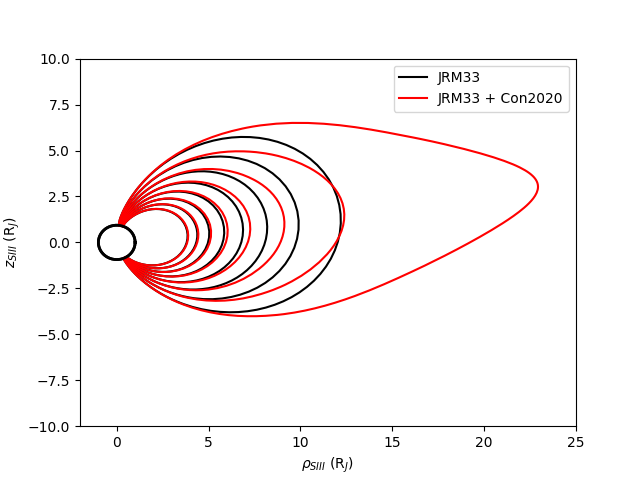

# JupiterMag

Python wrapper for a collection of Jovian magnetic field models.

This is part of a community code project : 

[Magnetospheres of the Outer Planets Group Community Code](https://lasp.colorado.edu/home/mop/missions/juno/community-code/)

**Authors**

- Marty Brennan - NASA JPL

- Matt James - University of Leicester

- Gabby Provan - University of Leicester

- Marissa Vogt - Boston University

- Rob Wilson - LASP

#### 

[](https://zenodo.org/badge/latestdoi/375402784)

## Requirements

For the Python code to run (without rebuilding the C++ backend), the following Python packages would be required:

- NumPy

- Matplotlib

- DateTimeTools

- RecarrayTools

- PyFileIO

all of which would be installed automatically if using `pip`.

On some systems, the shared object files would need rebuilding before they can be loaded and accessed using Python. Upon the first import of the `JupiterMag` module, if the shared object/DLL fails to load then it will attempt to use a local C++ compiler to rebuild the binaries.

### Linux

JupiterMag was built and tested primarily using Linux Mint 20.3 (based on Ubuntu 20.04/Debian). To rebuild the code, ensure that `g++`, `make` and `ld` are installed.

### Windows

This has been tested on Windows 10 (64-bit), other versions may also work. Requires `g++`, `make` and `ld` to work (these can be provided by TDM-GCC). 

### MacOS

This module has been tested on MacOS 11 Big Sur. It requires `g++`, `make` and `libtool` to recompile (provided by Xcode).

## Installation

Install using `pip3`:

```bash
pip3 install JupiterMag --user
```

Download the latest release (on the right -> if you're viewing this on GitHub), then from within the directory where it was saved:

```bash
pip3 install JupiterMag-1.0.0-py3-none-any.whl --user
```

Or using this repo (replace "1.0.0" with the current version number):

```bash
#pull this repo
git clone https://github.com/mattkjames7/JupiterMag.git
cd JupiterMag

#update the submodule
git submodule upate --init --recursive

#build the wheel file
python3 setup.py bdist_wheel
#the output of the previous command should give some indication of 
#the current version number. If it's not obvious then do
# $ls dist/ to see what the latest version is
pip3 install dist/JupiterMag-1.0.0-py3-none-any.whl --user
```

I recommend installing `gcc` >= 9.3 (that's what this is tested with, earlier versions may not support the required features of C++).

This module should now work with both Windows and MacOS

## Usage

### Internal Field

A number of internal field models are included (see [here](https://github.com/mattkjames7/libinternalfield/blob/main/README.md) for more information) and can be accessed via the ```JupiterMag.Internal``` submodule, e.g.:

```python
import JupiterMag as jm

#configure model to use VIP4 in polar coords (r,t,p)
jm.Internal.Config(Model="vip4",CartesianIn=False,CartesianOut=False)
Br,Bt,Bp = jm.Internal.Field(r,t,p)

#or use jrm33 in cartesian coordinates (x,y,z)
jm.Internal.Config(Model="jrm33",CartesianIn=True,CartesianOut=True)
Bx,By,Bz = jm.Internal.Field(x,y,z)
```

All coordinates are either in planetary radii (`x,y,z,r`) or radians (`t,p`). All Jovian models here use _R<sub>j</sub>_=71,492 km.

### External Field

Currently the only external field source included is the Con2020 field (see [here](https://github.com/mattkjames7/Con2020)), other models could be added in future.

This works in a similar way to the internal field, e.g.:

```python
#configure model
jm.Con2020.Config(equation_type='analytic')
Bx,By,Bz = jm.Con2020.Field(x,y,z)
```

### Tracing

Field line tracing can be done using the `TraceField` object, e.g.

```python
import JupiterMag as jm

#configure external field model prior to tracing
#in this case using the analytic Con2020 model for speed
jm.Con2020.Config(equation_type='analytic')

#trace the field in both directions from a starting position
T = jm.TraceField(5.0,0.0,0.0,IntModel='jrm09',ExtModel='Con2020')

```

The above example will trace the field line from the Cartesian SIII position (5.0,0.0,0.0) (R<sub>j</sub>) in both directions until it reaches the planet using the JRM09 internal field model with the Con2020 external field model. The object  returned, `T`, is an instance of the `TraceField` class which contains the positions and magnetic field vectors at each step along the trace, along with some footprint coordinates and member functions which can be used for plotting.

A longer example below can be used to compare field traces using just an internal field model (JRM33) with both internal and external field models (JRM33  + Con2020):

```python
import JupiterMag as jm
import numpy as np

#be sure to configure external field model prior to tracing
jm.Con2020.Config(equation_type='analytic')
#this may also become necessary with internal models in future, e.g.
#setting the model degree

#create some starting positions
n = 8
theta = (180.0 - np.linspace(22.5,35,n))*np.pi/180.0
r = np.ones(n)
x0 = r*np.sin(theta)
y0 = np.zeros(n)
z0 = r*np.cos(theta)

#create trace objects, pass starting position(s) x0,y0,z0
T0 = jm.TraceField(x0,y0,z0,Verbose=True,IntModel='jrm33',ExtModel='none')
T1 = jm.TraceField(x0,y0,z0,Verbose=True,IntModel='jrm33',ExtModel='Con2020')

#plot a trace
ax = T0.PlotRhoZ(label='JRM33',color='black')
ax = T1.PlotRhoZ(fig=ax,label='JRM33 + Con2020',color='red')

ax.set_xlim(-2.0,25.0)
ax.set_ylim(-10.0,10.0)
```

The resulting objects T0 and T1 store arrays of trace positions and magnetic field vectors along with a bunch of footprints.The above code produces a plot like this:


